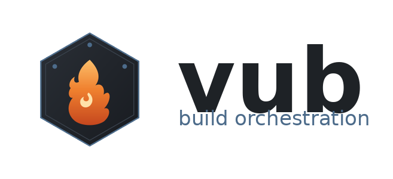

# Vub



Vub is a lightweight build-orchestration language: a single `forge.vub`
config file that defines build targets and file operations, run with a
small self-contained interpreter. See `Vub_Language_Specification_1.0.md`
for the full language reference (targets, chaining, file operations,
CLI flags, grammar, exit codes).

This package contains a native Windows build of the interpreter and an
installer for it.

## What's in this package

| File | Description |
|---|---|
| `vub.exe` | The Vub interpreter, compiled for 64-bit Windows. No Python installation required — the runtime is bundled in. |
| `VubSetup.exe` | Windows installer (built with NSIS) that installs `vub.exe`, adds it to your `PATH`, and creates Start Menu shortcuts. |
| `installer.nsi` | The NSIS source script used to build `VubSetup.exe`, in case you want to rebuild or customize it. |
| `vub.py` | The interpreter's Python source. This is what `vub.exe` is compiled from. |
| `forge.vub` | An example, self-contained Vub build file (interpreter + config in one file) for a C++ project. |
| `LICENSE.txt` | License shown in the installer's license page. |
| `vub.ico` | The application icon (embedded in `vub.exe`, used by the installer and Start Menu shortcuts). |
| `vub_mark.svg` | Source vector for the icon mark — a forge flame on a hex-bolt badge, referencing `forge.vub` and the tool's build/mechanical domain. |
| `vub_wordmark.png` | Icon + logotype lockup, for docs, READMEs, or a project site. |

## Installing

Run `VubSetup.exe` and follow the prompts. It will:

1. Install `vub.exe` to `C:\Program Files\Vub` (customizable during setup).
2. Optionally add that folder to your system `PATH` (on by default), so
   you can run `vub` from any Command Prompt or PowerShell window.
3. Optionally associate `.vub` files with Python (on by default), so
   double-clicking `forge.vub` opens a terminal with the interactive
   `vub>` shell. This requires Python to be installed; if it isn't found,
   the installer skips the association with a notice.
4. Create Start Menu shortcuts: a "Vub Command Prompt" opened in the
   install directory, a link to this README, and an uninstaller.
5. Register an Add/Remove Programs entry so it can be cleanly removed
   from *Settings → Apps*.

**Silent install** (for scripted/unattended setups):

```bat
VubSetup.exe /S
```

**Silent uninstall:**

```bat
"C:\Program Files\Vub\Uninstall.exe" /S
```

No installer? Just copy `vub.exe` anywhere and run it directly — it's a
single, self-contained executable with no other dependencies.

## Using vub.exe

Once installed (and on your `PATH`), open a new Command Prompt or
PowerShell window in your project folder and run:

```bat
vub --list          REM show all targets defined in forge.vub
vub --version       REM show version (1.0) and compile date
vub about           REM show info (made by Sourasish Das)
vub build            REM run the "build" target
vub build -test       REM dry run: show what would happen without doing it
vub build -info       REM verbose: show detailed execution info
vub build -test -run -docs   REM chain extra targets after "build"
vub --help
```

If no target is given, `vub` runs whatever target `define "default"
execute = "..."` points to in your `forge.vub`.

**Interactive shell:** double-clicking `forge.vub` (or running it with no
arguments) opens an interactive `vub>` prompt where you can type a target
name — e.g. `build` — and run it, plus `--list`, `about`, `--version`,
`--help`, or `exit` to leave.

Write your own `forge.vub` in a project directory using the syntax
described in `Vub_Language_Specification_1.0.md`, for example:

```vub
; Project: MyApp
makefile "build"

define "build" execute = "gcc -Wall -O2 src/*.c -o myapp"
define "test" execute = "python tests/run_tests.py"
define "clean" execute = "rm -rf build/ *.o"
define "all" execute = "build test"
define "default" execute = "build"

copyfile "config/default.json" "build/config.json"
```

`vub.exe` reads `forge.vub` from the current directory by default; pass
`--file path\to\other.vub` to point it at a different file.

> **Note on shell commands:** the commands inside `execute = "..."`
> (e.g. `gcc`, `rm`, `python`) are run through the system shell exactly
> as written. On Windows this means Unix-style commands like `rm -rf`
> won't work unless the corresponding tool is on your `PATH` (e.g. via
> Git Bash, WSL, or Windows equivalents like `del`/`rmdir`). Vub itself
> doesn't translate commands between platforms — write `forge.vub`
> commands for whatever shell/toolchain your project actually uses.

## Branding

The mark is a stylized forge flame set inside a hex-bolt badge — a nod to
`forge.vub` and to Vub's build/tooling domain, rather than a generic
letterform. Palette: charcoal `#181B20`/`#2A2F36` badge, steel-blue
`#4C6B8A` ring and rivets, ember gradient `#FBBF6B → #F0812F → #C5471E`
flame. `vub.ico` is embedded directly into `vub.exe` and used throughout
the installer and Start Menu shortcuts; `vub_mark.svg` is the editable
source if you want to re-export at other sizes or recolor it.

## How this was built

`vub.exe` is produced with [PyInstaller](https://pyinstaller.org)
(`--onefile` mode), which bundles the Python interpreter and standard
library together with `vub.py` into a single executable. `VubSetup.exe`
is compiled from `installer.nsi` with
[NSIS](https://nsis.sourceforge.io/) (`makensis`).

For this package specifically, both were built and verified without a
Windows machine: a portable Windows Python distribution
([astral-sh/python-build-standalone](https://github.com/astral-sh/python-build-standalone))
was run under Wine on Linux to execute PyInstaller, and `makensis`
(which is natively cross-platform) compiled the installer directly on
Linux. The resulting `vub.exe` and `VubSetup.exe` were then smoke-tested
under Wine: `vub.exe --list` / `-test` ran correctly, and a full silent
install/uninstall cycle via `VubSetup.exe /S` was verified to place all
files correctly, register `PATH` and Add/Remove Programs entries, and
remove all of them cleanly on uninstall.

That said, the most reliable way to (re)build this on a real Windows
machine — recommended if you plan to maintain this project going
forward — is:

**1. Build `vub.exe`** (requires Python 3.9+ on Windows):

```bat
pip install pyinstaller
pyinstaller --onefile --name vub --console --clean vub.py
REM output: dist\vub.exe
```

**2. Build `VubSetup.exe`** (requires [NSIS](https://nsis.sourceforge.io/) installed):

```bat
copy dist\vub.exe .
makensis installer.nsi
REM output: VubSetup.exe
```

Both steps can also be automated in CI (e.g. a GitHub Actions workflow
using a `windows-latest` runner, `pip install pyinstaller`, and
`choco install nsis`) if you want reproducible, from-source builds
going forward.

## Uninstalling

Use **Settings → Apps → Vub → Uninstall**, or run
`C:\Program Files\Vub\Uninstall.exe` directly. This removes the
installed files, Start Menu shortcuts, the `PATH` entry, and the
Add/Remove Programs registration.

## Known limitations

- `vub.exe` is 64-bit only.
- `VubSetup.exe` is a standard 32-bit NSIS installer executable (this is
  normal for NSIS — it runs fine under 64-bit Windows via WOW64, and
  still installs the 64-bit `vub.exe`).
- Vub itself just shells out to whatever commands you write in
  `forge.vub` — it doesn't include a compiler, `gcc`, `git`, `npm`, etc.
  Those need to already be available on your system for your build
  commands to succeed.
